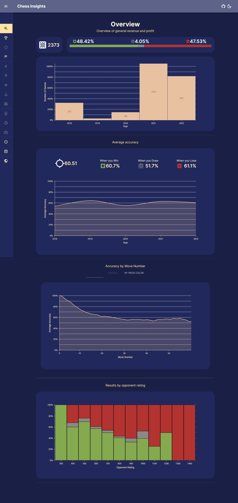

# Chess Insights

Chess insights drawn by analyzing Chess.com games of a player.



# Installation

- Install MongoDB onto your computer: [Installation Instructions](https://www.mongodb.com/docs/manual/administration/install-community/)
- Add a .env file to the [`server`](/server/) directory. Inside add:

```env
MONGO_URL = <url-to-your-mongo-db>
PORT=5001
```

- Install all the dependencies using:

```zsh
npm i
```
- Uncomment the part in [`server/index.js`](server/index.js) that talks about importing data. After the first run of the server, make sure to re-comment this.  
https://github.com/nikhil-ravi/MERN-admin-dashboard/blob/cd695792df1ee7c10d68a404d15008c48b5b0dbd/server/index.js#L57-L62
- Move into your client directory and install all of their dependencies:

```zsh
npm i
```
- Add a .env.local file to the [`client`](client/) directory. Inside add:

```env
REACT_APP_BASE_URL=http://localhost:5001
```

- Open up two terminals and run these commands:

```zsh
cd server
npm run dev
```

```zsh
cd client
npm run start
```

- This should automatically open react, it may take a while to load...